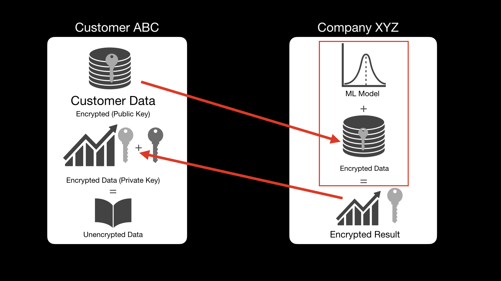

# Homomorphic-Encryption

This code has three files. 
Cust.py sits with the customer and includes methods to generate and store a private/public key pair and methods to help decrypt the answer onces received from the company
servercalc.py and linmodel.py sit with the ML company that provides ML services. They would receive a json object with encrypted data and use the weights from the model in linmodel.py and do the calculations in servercalc.py. This file also includes method to package up the answer and return it bak to the customer.

To see this in action please visit: https://youtu.be/nlsd2LO-S50
